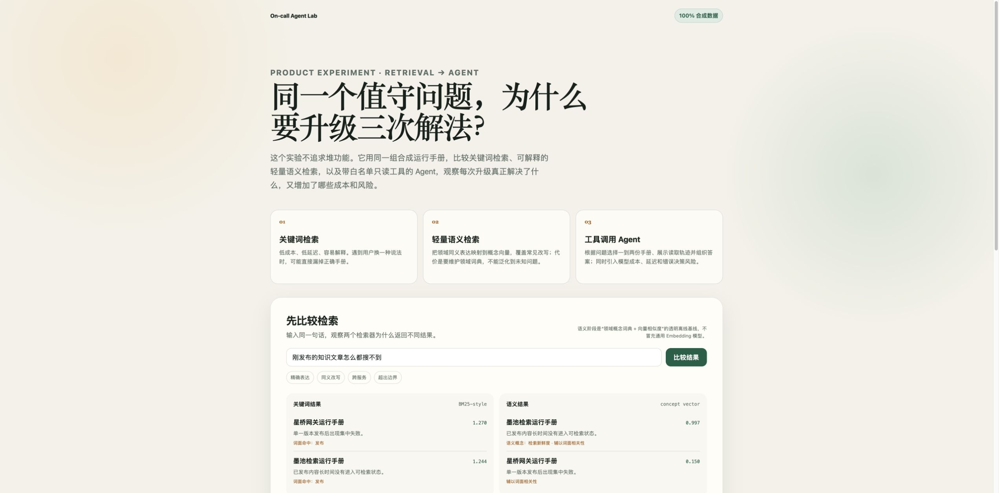

# On-call 故障排查助手

输入故障现象，从运行手册中找到相关处理步骤，并给出带来源的排查建议。



## 产品流程

```text
描述故障 → 检索相关 SOP → Agent 读取文档 → 输出处理建议与引用
```

项目保留了三种方式，方便观察从“搜索”到“助手”的变化：

1. 关键词搜索：适合明确的错误码或组件名。
2. 语义搜索：用户不需要使用和手册完全一致的表达。
3. Agent：选择并读取相关手册，整理成可执行步骤，同时展示工具调用过程。

## 产品原则

- 只读取白名单内的运行手册，不能访问任意文件。
- 回答必须标注使用了哪些文档。
- 找不到依据时停止回答，不编造处理步骤。
- 默认离线运行；Live 模式需要显式开启。

仓库中的服务、命令和运行手册均为虚构内容，只用于产品演示。

## 本地运行

```bash
python3 -m venv .venv
source .venv/bin/activate
pip install -r requirements-dev.txt
python -m pytest
python -m evals.run_eval
uvicorn main:app --reload
```

浏览器打开 `http://127.0.0.1:8000`。

## 当前状态

- 12 项自动化测试通过。
- 13 个合成问题用于检查检索、引用和越界拒答。
- GitHub Actions 已通过。

这些结果只适用于当前的小型合成数据，不能代表真实生产环境的准确率。

## 数据边界

离线模式不会向外部服务发送问题。Live 模式会把问题和相关手册内容发送给配置的模型服务商，请勿输入真实故障信息、凭证或其他敏感数据。

## 技术

`FastAPI` · `BM25-style Search` · `Semantic Retrieval` · `Tool-calling Agent`

当前未授予开源复用许可，详见 [LICENSE-REVIEW.md](LICENSE-REVIEW.md)。
